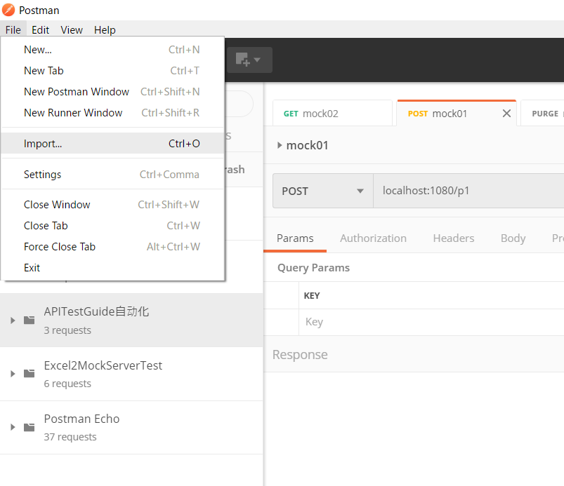
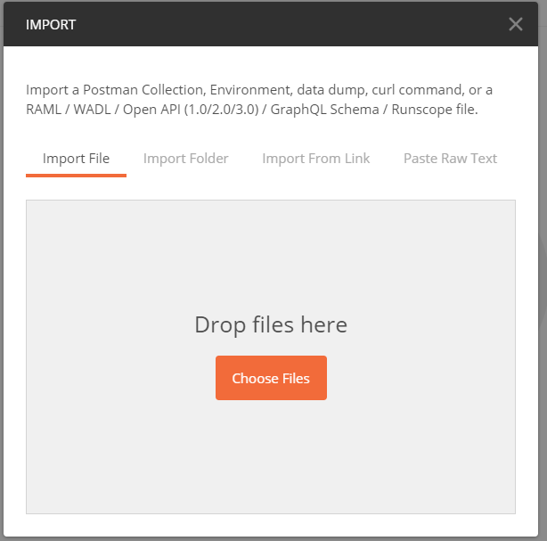
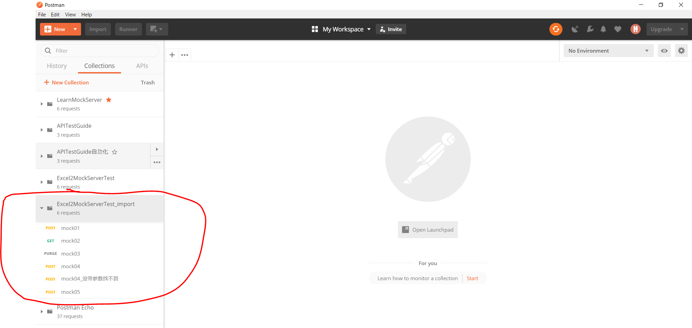
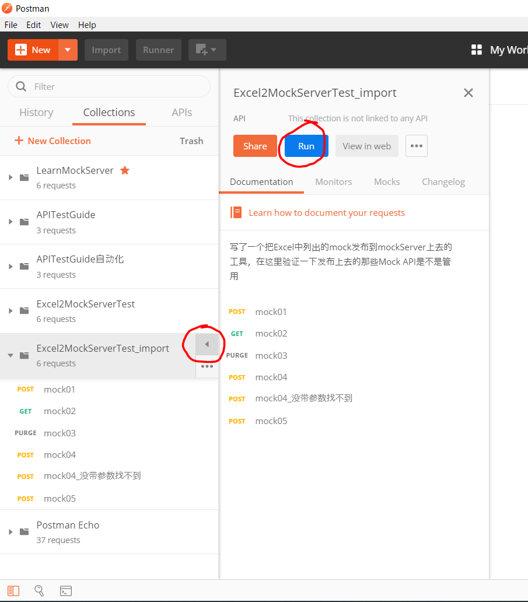
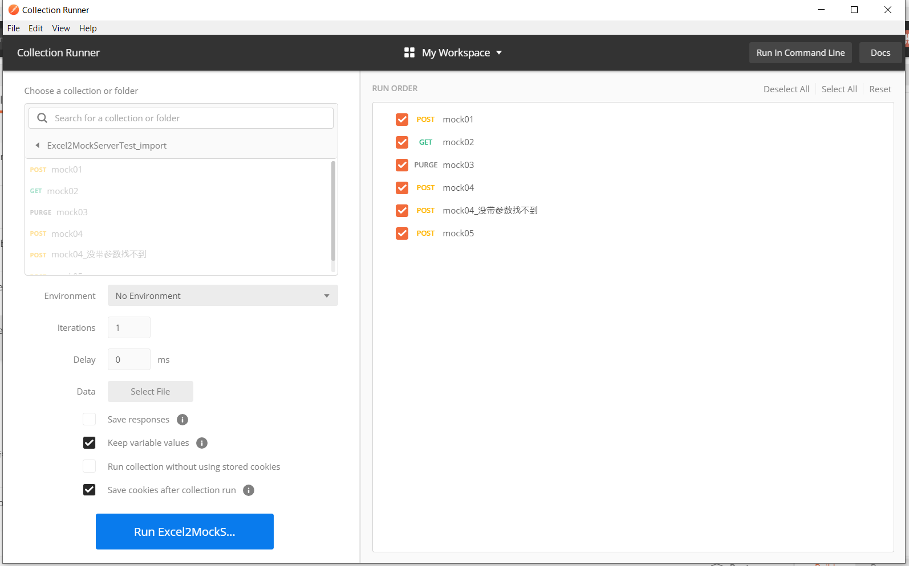
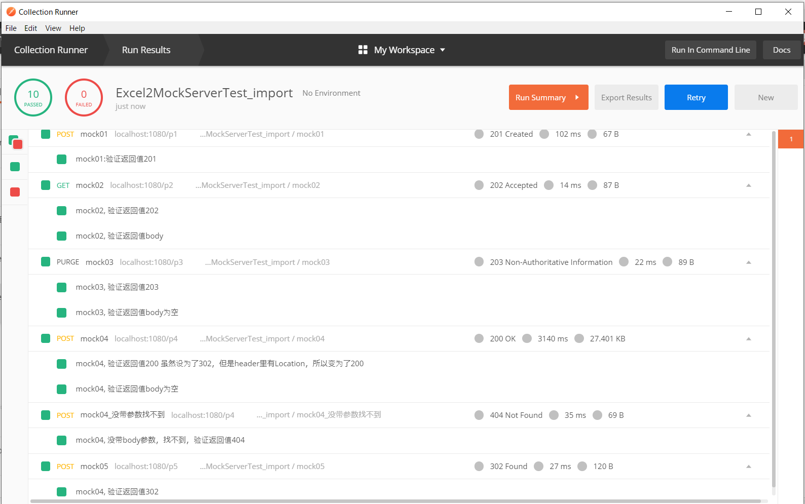

# Postman验证guide

+ 先导入postman的collection
  
  
+ 把文件 PostmanFiles\Excel2MockServerTest.postman_collection_import.json 拖到窗口中去  
  
  
+ 导入成功，能看到这个collection  
  
  
+ 准备运行  
  
  
+ Collection Runner出现  
  
  
+ 可以看到运行成功  
  
用newman导出生成report的部分，先省略了

