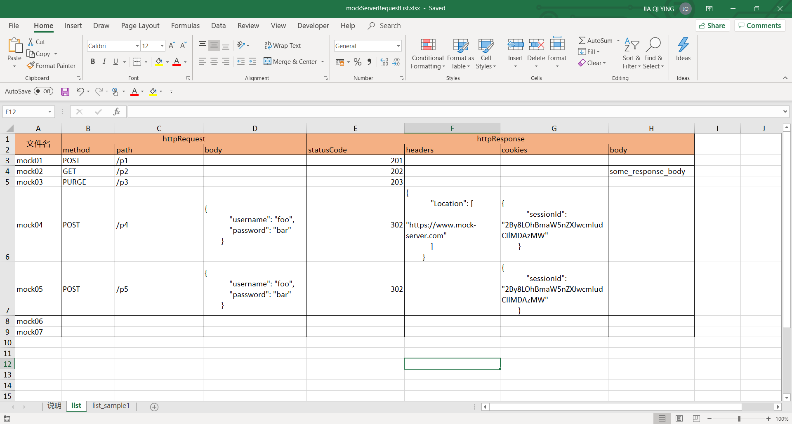
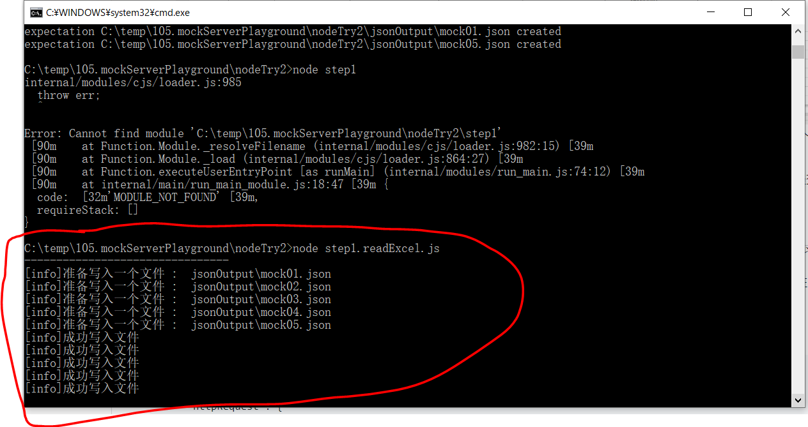
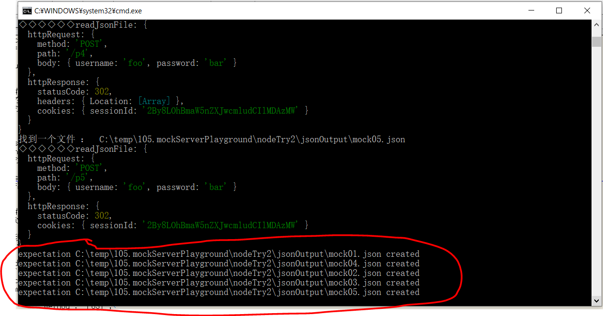
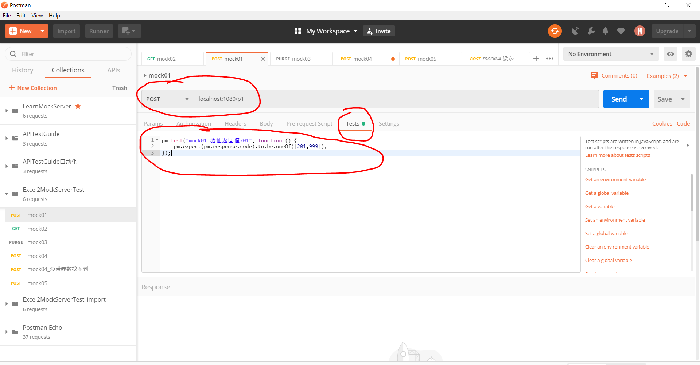
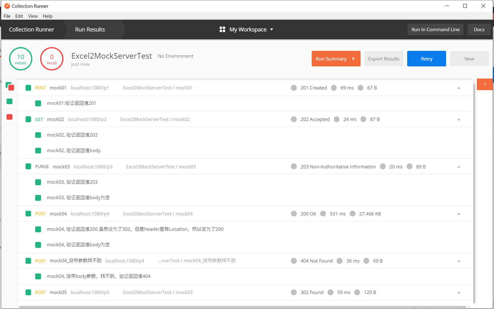

# Excel2Mockserver
write multi requests in Excel files and send it to Mockserver by nodejs


:bulb:试着做了一个工具，把excel里面的多条mock规则，提交到mockServer(我用的本地docker版)


### 大致思路
1. 在Excel里面搞张列表，有个格式，可以写复数多条mock的规则。  
1. 用nodejs的代码，excel里面的复数条的信息，生成复数个json文件到一个目录中去
1. 用nodejs的代码，把指定目录里的json文件都读进来，提交到mockserver上去


GETTING START


### 详细  
* 准备工作  看一下excel例子里面的API设定  
  
<br>
* step1(第一个nodejs程序)  
用nodejs（exceljs）把Excel表格里的信息读出来，生成JSON数据。（暂定每行生成一个JSON文件，为指定一个目录，都写到那个目录里去）  
  
<br>
  
* step2(第二个nodejs程序)  
把指定目录里的所有文件，依次（误：其实是同步的）读入，一个个地往mockserver提交。
  
<br>
### 手动验证一下结果  
在postman上验证一下刚才登录的那些api  
  
在postman里验证每一个API，例如返回码的script验证


然后看一下run的结果，都是OK的



### 背景
试过用nodejs端提交单条的mock规则，运行成功。(就试了mockAnyResponse的path方式，其他的规则还没来得及学习)

发现提交时的传参expection, 就是个纯正的JSON object，内容基本就是一个httpRequest 加上 一个httpResponse。
注：再往下一层的参数有很多，可以指定也可以省略（全匹配，比如"method": "POST"不指定，那么GET/POST之类的全管用）

nodejs端提交单条的mock规则的例子代码如下：
```
mockServerClient("localhost", 1080).mockAnyResponse({
//mockServerClient("localhost", 32768).mockAnyResponse({
    "httpRequest": {
        "method": "POST",
        "path": "/login",
        "body": {
            "username": "foo",
            "password": "bar"
        }
    },
    "httpResponse": {
        "statusCode": 302,
        "headers": {
            "Location": [
                "https://www.mock-server.com"
            ]
        },
        "cookies": {
            "sessionId": "2By8LOhBmaW5nZXJwcmludCIlMDAzMW"
        }
    }
}).then(
    function () {
        console.log("expectation #1 created");
    },
    function (error) {
        console.log(error);
    }
);
```


